# Automated Backup to S3 using Bash Script

## Project Summary

This project automates the backup of files from an EC2 instance to an S3 bucket using a Bash script and AWS CLI. The script runs every 2 minutes via a cron job, compresses the backup file, and stores it both locally and in S3.

### Tools Used:
- AWS (EC2, S3, IAM)
- Bash Scripting
- Cron Jobs
- AWS CLI

---

## Project Description

This project demonstrates how to automate backups using a Bash script on an AWS EC2 instance. It ensures periodic backups are securely stored in an S3 bucket.

---

## Steps to Implement

### Step 1: Launch EC2 Instance
- Created an EC2 instance and logged in.
- Assigned an IAM role for S3 access.

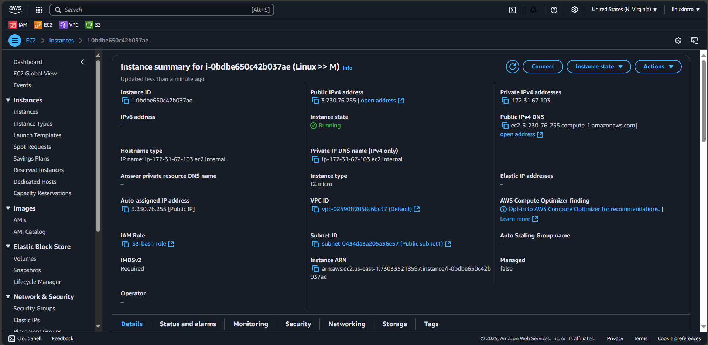

### Step 2: Install AWS CLI
- Downloaded and installed AWS CLI for S3 interaction.

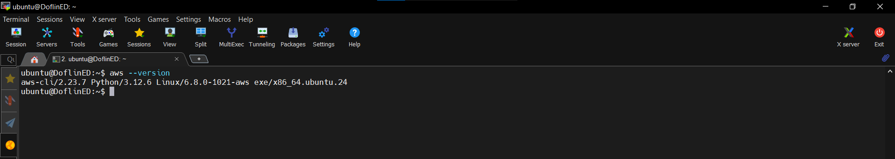

### Step 3: Configure IAM Role & User
- Created an IAM user with `AmazonS3FullAccess` permissions.
- Assigned an IAM role with `SSMFullAccess` and `S3FullAccess`.

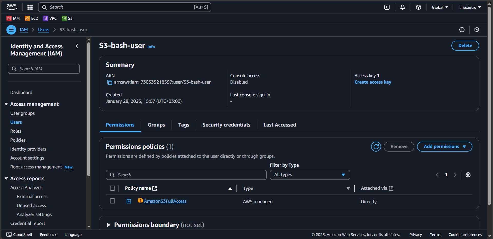
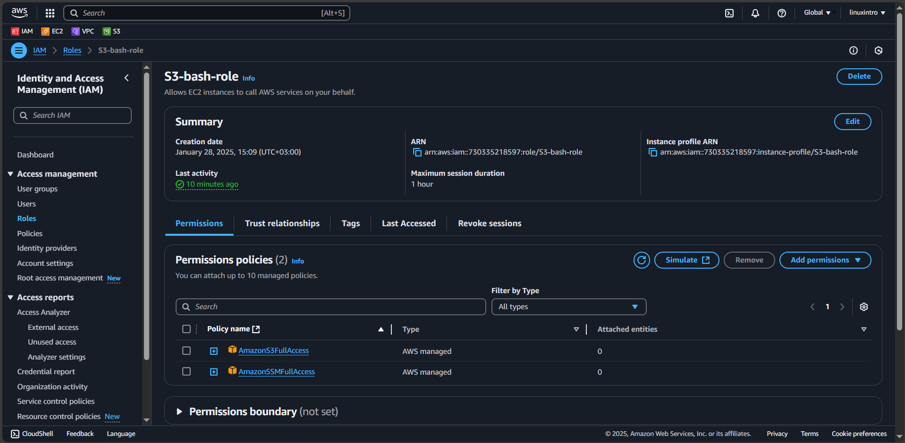

### Step 4: Create an S3 Bucket
- Used AWS CLI to create an S3 bucket.

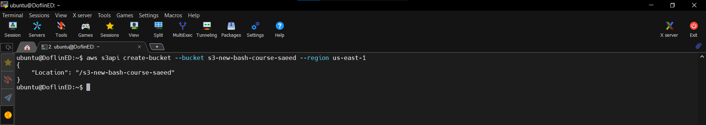

### Step 5: Create and Configure the Bash Script
- Developed a Bash script to:
  1. Copy files locally.
  2. Compress the backup folder.
  3. Upload the compressed file to S3.

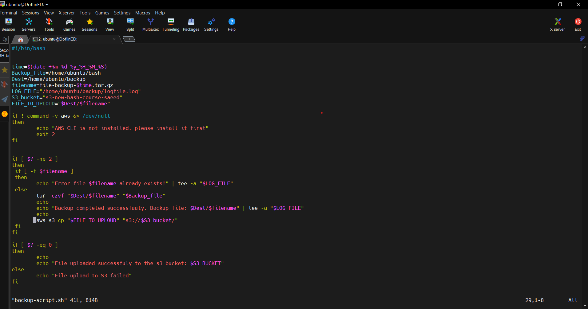

### Step 6: Execute the Script
- Ran the script manually to ensure proper execution.

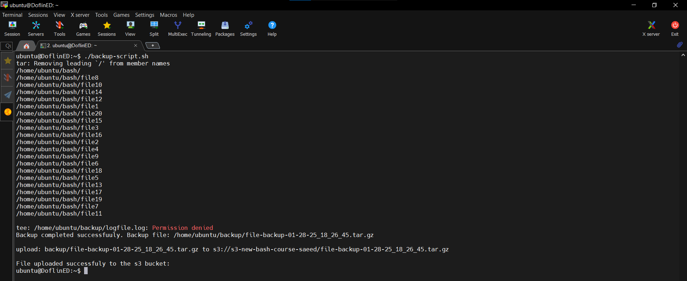

### Step 7: Configure Cron Job
- Added the script to `/etc/crontab` to execute automatically every 2 minutes.

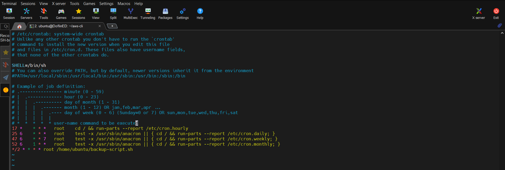

### Step 8: Verify Backups
- Checked the backup file locally and on S3.
- Verified the log file to confirm execution.

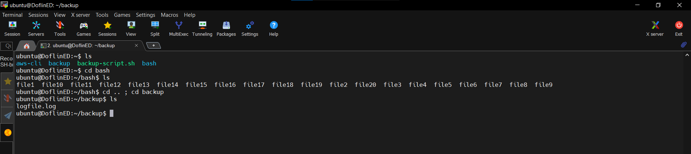
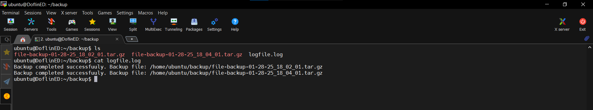
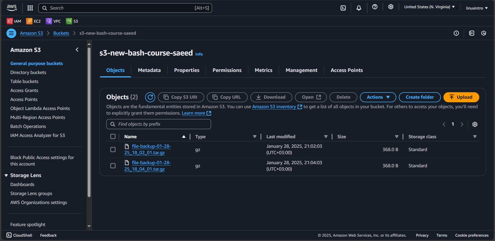

---

## How to Use

1. Clone this repository:
   ```bash
   git clone https://github.com/SaaedT/AWS-S3-Backup-Automation.git
   ```
---

## Conclusion

This project showcases how to automate periodic file backups from an EC2 instance to an S3 bucket using a Bash script and AWS CLI. The automation ensures data security and availability with minimal manual intervention.

